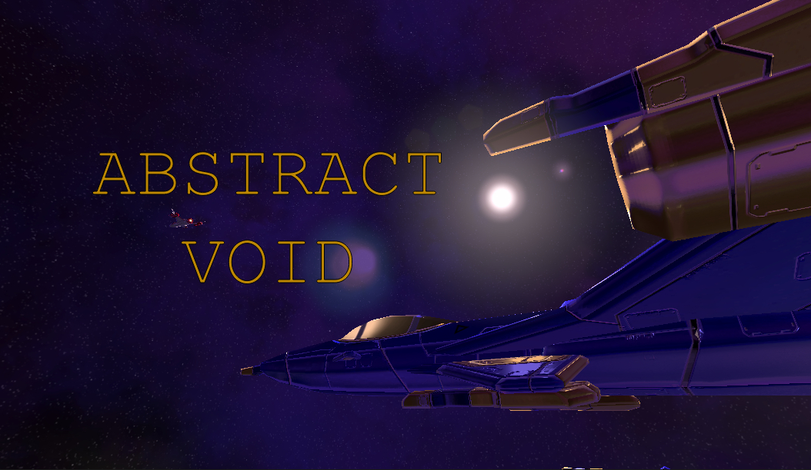
## Description

Abstract void is a space action adventure game with strategy elements where players will manage their fleets, gather resources and defeat their opposition.

Total working time: Approx. 20 Days

General Features:
* Ship creation and customization
* Saving
* Battling
* Traversal

## Assignment Features

### Lighting
Wasn't sure what to do for the "light section" Unsure if you wanted me to actually edit the light in unity or to make shaders... I asked others and wasn't sure, and I really don't want to be the guy that's consistantly asking for help. so hopefully this good.

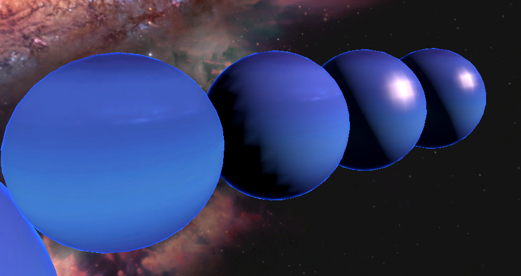

(In order)
Ambient + Rim Light
Ambient + Diffuse (Lambert Model) + Rim Light
Specular + Diffuse + Rim Light
Ambient + Diffuse + Specular (Blinn Model) + Rim Light

The Ambient Diffuse textures I took help from the official unity form (See below) it's very similar with minor property changes to give more control
The Blinn shader is taken from class, again minor changes for increased control

Why rim light? Because it counts for one of the sections, and looks like atmosphere

## Post Processing

### Color Grading (old): 

Default:
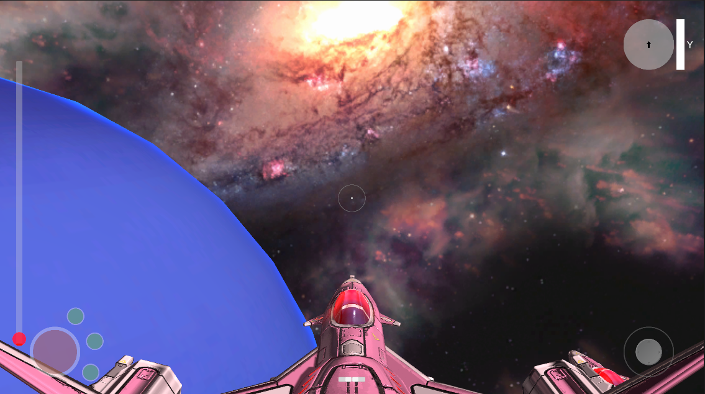

Normal:

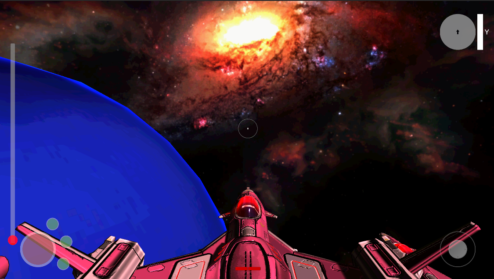
Cool:

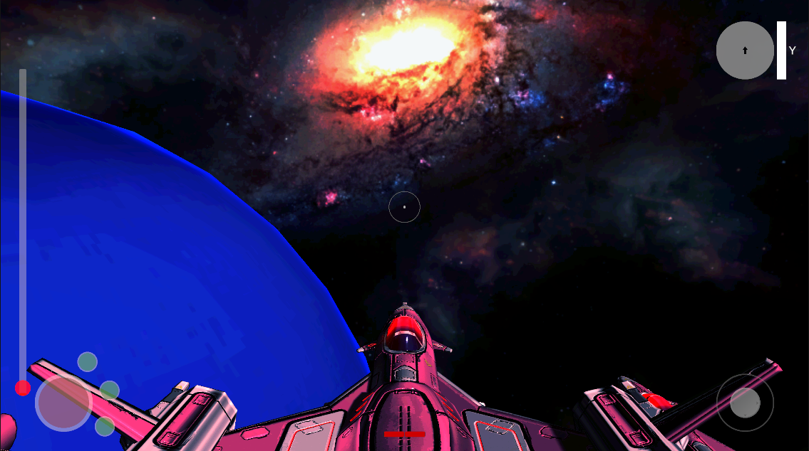
Warm:

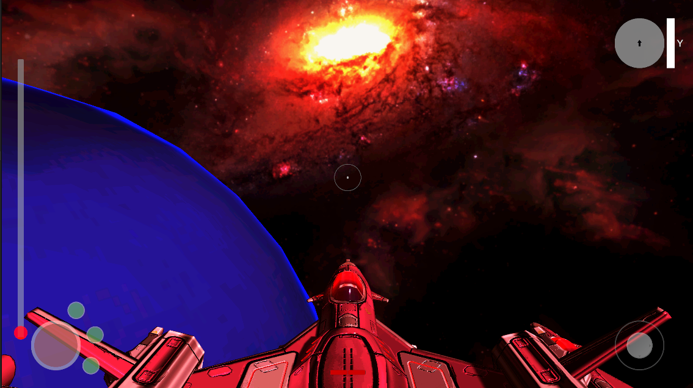

Custom (Warm + Contrast):
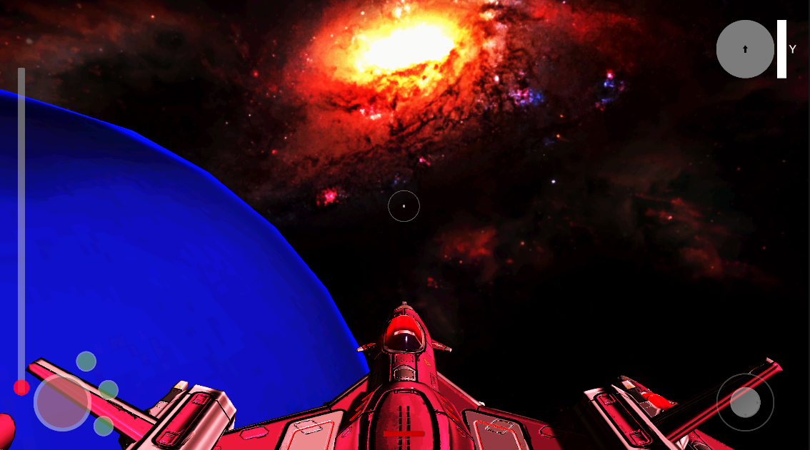

### Chromatic aberration
It follows an animation curve with texture tiling, Same SRP implementation as what was provided in files (Thanks a lot btw, very cool effect!), uses post processing volume, but it's very hard to notice, and makes me think I need to learn the URP alt... but because we're going to unreal (And I want to go to unreal), I'm probably gunna stick to what's easier here.
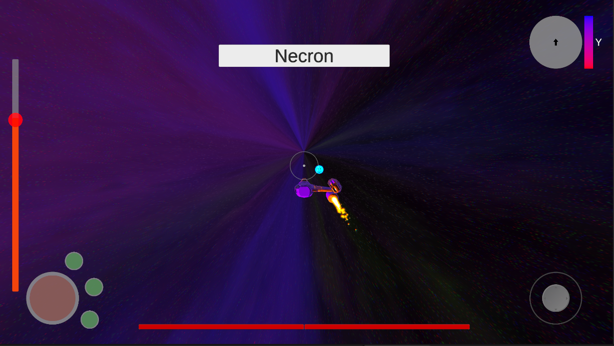

### Blooom
Same as what we did in class, bloom implementation, but I used the post process volume
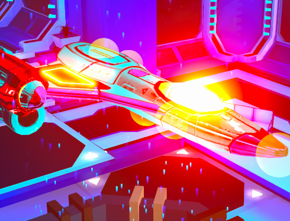

LUTs seem to always look bad, not sure why... They look really good in Photoshop

### Custom
Rim lighting (Explained earlier)
Normal extrusion ( Bump mapping) Gives the game a more "BorderLandsy" Rough and tumble type look. Also helps improve areas that got color graded too hard when I was making the texture white. When normals are 1, everything looks like a toy, when normals are 10 everything looks borderlands

I think they all look cool in their own way

10x Normals:

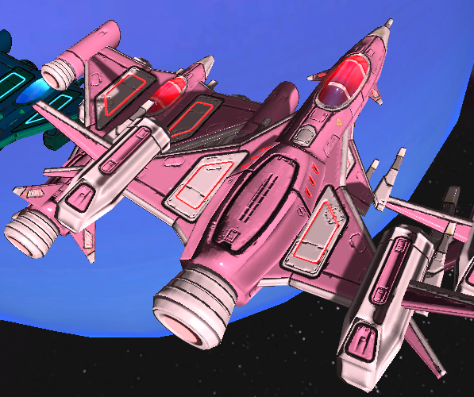

0x Normals:

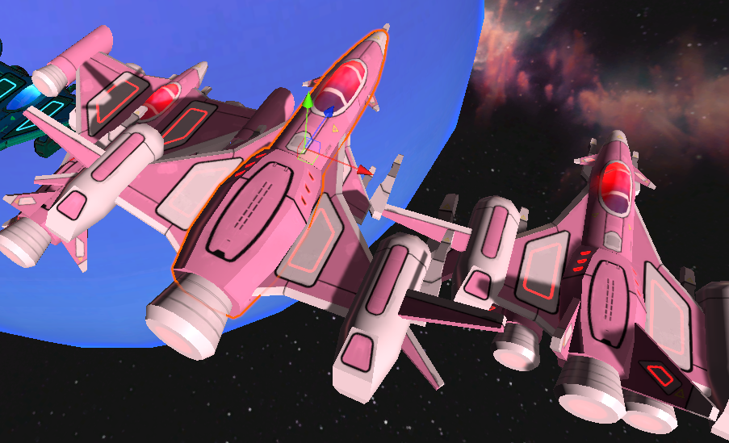

1x Normals:

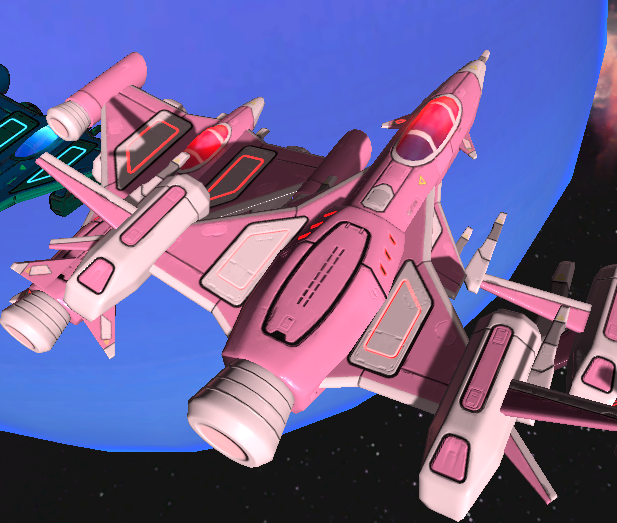

Color selector:

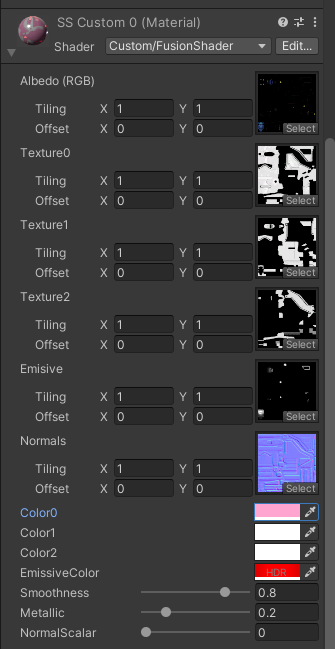

### Skybox
TYRO: (USING)

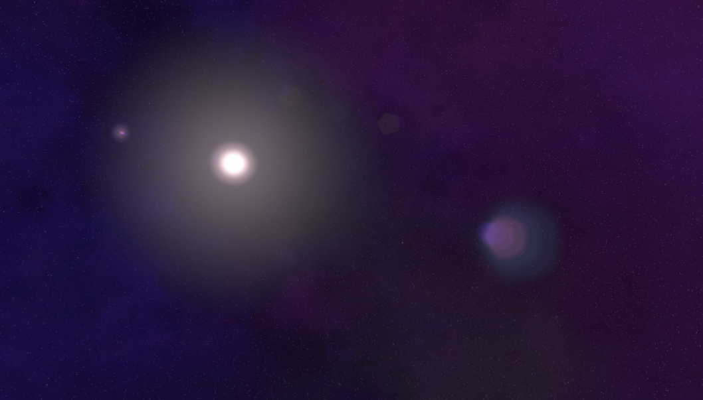

My custom attempt (NOT USING)

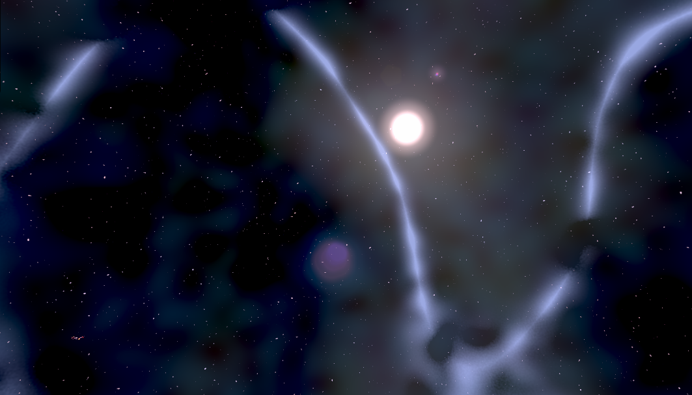

### Particles
CPU particles:

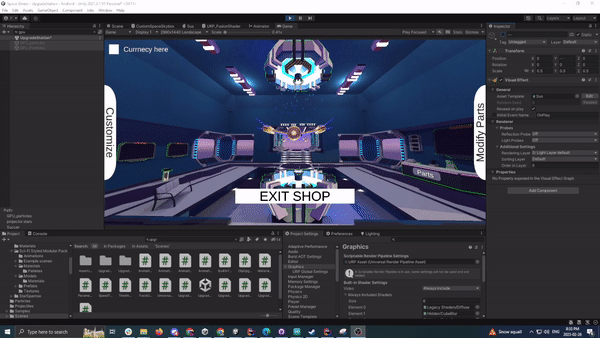

GPU Particles:

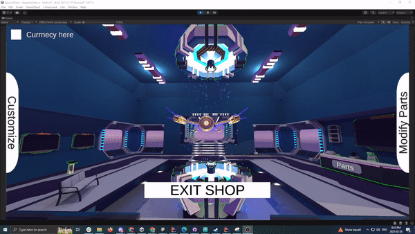
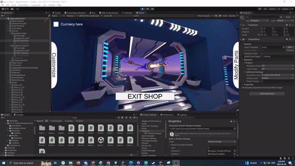
### Outlining effect
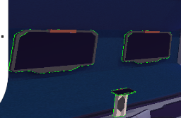

### Lens Flares

### Decals
Project a texture onto a surface using the scenes depth. The object is set to look at where the cam was when placed.
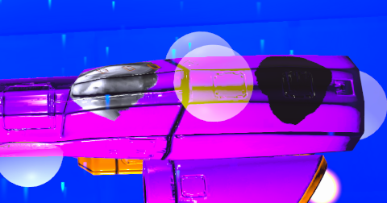

### Bill Boarding
Transforms the object to look at, and always be a set distance in front of the player. I'll probably modify this so eventually you can actually fly to the planet naturally. 
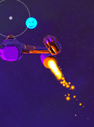

### Texture Tiling
Just modify the UVs along a vector2 for screen direction multiplied by scale which is an animation curve.

### Stencils
Just a simple stencil buffer in a secondary HLSL version of my URP fusion shader, along with a "window" stencil on another object
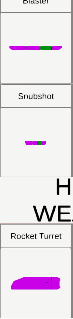

## NOTES | (Updated each assignment)
Notes in short cus I'm lazy
* Still a fun project
* Game will be ready in August
* More effects need to be added and tweaked
* Saving is kinda scuffed and I'm unsure why, but I don't have time to work on it
* Sometimes the scene's lighting breaks and I'm not sure why
* Marks > Gameplay in a graphics course lol
* As fun as a solo project is, it's very time consuming...
* I am very tired, and definitely missed something somewhere. I made so many mistakes in the vid lol

## Resources and Links

[Youtube Video Assignment 1](https://youtu.be/mPkiP0KxTGw)

[Youtube Video Assignment 2](https://youtu.be/M33u_Xt4gQE)

[Google slides Assignment 1](https://docs.google.com/presentation/d/1b1NrIQdTX083GBhReAvFBrGcwF4PFgROCB6B2utCwPA/edit?usp=sharing)

[Google Slides Assignment 2](https://docs.google.com/presentation/d/1-ya4YOdd23T-f0EnUmP507uGf4BSvMQ88fiNTJCULbE/edit?usp=sharing)

[Unity shader fundamentals: (I needed it to help figure out how to combine the code because the shaders from class were written with vertex and frag instead of surface shaders)](https://docs.unity3d.com/Manual/SL-VertexFragmentShaderExamples.html)

[Star sparrow modular space ship](https://assetstore.unity.com/packages/3d/vehicles/space/star-sparrow-modular-spaceship-73167)

[Joystick Pack (Because I'm lazy, and why remake the wheel)](https://assetstore.unity.com/packages/tools/input-management/joystick-pack-107631~~)

[Modular Sci-fi pack](https://assetstore.unity.com/packages/3d/environments/sci-fi/sci-fi-styled-modular-pack-82913)

[Tyro Procedural Skybox](https://tools.wwwtyro.net/space-3d/index.html#animationSpeed=1&fov=80&nebulae=true&pointStars=true&resolution=1024&seed=4ueppfqf5qc0&stars=true&sun=true)
